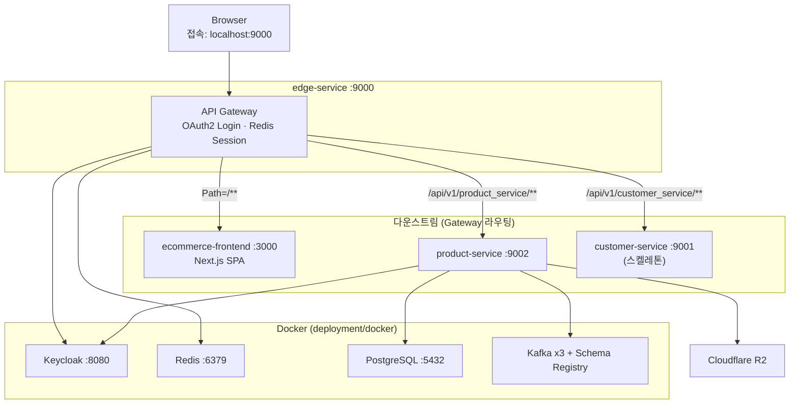

# Ecomart — MSA E-Commerce Backend

Spring Boot 기반의 **마이크로서비스 이커머스 백엔드**입니다. API Gateway·인증·상품 도메인을 분리하고, **헥사고날 아키텍처(포트/어댑터)** 와 **DDD** 를 적용해 확장 가능한 구조를 목표로 설계·구현했습니다.

> 프론트엔드(Next.js)는 별도 저장소 [ecommerce-frontend](https://github.com/Youngwook-Jeon/ecommerce-frontend) 에 있습니다. Gateway가 SPA를 프록시하므로 로컬에서는 두 저장소를 함께 실행합니다.

---

## 프로젝트 하이라이트 & 핵심 문제 해결

기능 구현을 넘어, **대규모 트래픽**과 **복잡한 상품 도메인**을 전제로 한 엔지니어링 의사결정을 정리했습니다.

| 영역 | 한 줄 요약 |
|------|------------|
| 조회 최적화 | 카테시안 곱·N+1 방어, 배치 fetch·쿼리 분리 |
| **공개 PLP 키워드 검색** | `pg_trgm` GIN(이름+브랜드 통합), 선택도별 **~8–11배** GIN 우위 검증 |
| 도메인 동기화 | 옵션 값 이미지 → Variant 썸네일 일괄 반영 |
| 이미지 파이프라인 | R2 Presigned URL로 서버 우회 업로드 |
| 아키텍처 | 헥사고날·DDD로 도메인과 인프라 격리 |

### 1. CQRS · 다중 컬렉션 조회 최적화 (카테시안 곱 방어)

**문제**  
`Product` → `OptionGroup` → `OptionValue`로 이어지는 깊은 집합 구조에서 다중 Fetch Join 시 카테시안 곱 폭증, 연관 컬렉션 로딩 시 N+1이 발생할 수 있습니다.

**적용**
- Hibernate `default_batch_fetch_size` 기반 **IN 절 배치 로딩**
- 연관 그래프를 한 번에 끌어오지 않고, **1차 캐시·쿼리 분리**로 읽기 경로 정리
- CQRS 스타일로 **조회(Queries)** 와 **명령(Commands)** 책임 분리

### 2. 복잡한 도메인 상태 동기화 (Variant Image Sync)

**문제**  
옵션 값(`OptionValue`)에 이미지가 붙으면, 해당 조합을 쓰는 모든 **Variant(SKU)** 의 대표 썸네일이 동일 규칙으로 맞춰져야 합니다.

**적용**
- 출력 포트 `VariantMainImageSyncPort` 로 동기화 책임을 도메인 밖으로 분리
- 갱신 대상 Variant를 **메모리에서 그룹화(In-Memory Grouping)** 후 일괄 반영해 **DB 쓰기 횟수 최소화**

### 3. 클라우드 스토리지 최적화 (비용 · 성능)

**문제**  
관리자 이미지 업로드가 API 서버를 경유하면 메모리·대역폭·타임아웃 부담이 커집니다.

**적용**
- **Cloudflare R2**(S3 호환) **Presigned URL** — `presign` → 클라이언트 **직접 PUT** → `commit` 확인
- 바이너리 트래픽을 애플리케이션 서버 밖으로 분리

### 4. 헥사고날 아키텍처 · DDD

**문제**  
JPA 엔티티와 비즈니스 규칙이 한 레이어에 섞이면 상태 전이·검증 로직이 흩어지고 테스트가 어려워집니다.

**적용**
- `product-domain-core`를 DB · Kafka · R2와 **포트/어댑터**로 격리
- **JPA Entity ↔ Domain Model** 매핑 분리, Aggregate 단위로 비즈니스 룰 응집

### 5. 공개 PLP 키워드 검색 (`pg_trgm` GIN · 선택도)

**문제**  
상품 목록 검색 시 `LIKE '%키워드%'` 로 인한 풀 스캔 성능 저하 우려 및 `name OR brand OR description` 조건 결합 시 발생하는 **BitmapOr** 오버헤드.

**적용 및 검증**
- `description`을 검색 대상에서 제외하고, `name`과 `brand`를 결합한 **단일 GIN 인덱스(`pg_trgm`)** 구축  
  (`lower(coalesce(name,'')) || ' ' || lower(coalesce(brand,''))`)
- Testcontainers(PostgreSQL) 기반 5만 건 시드 데이터로 **선택도 구간별 플래너 실행 계획 및 시간 벤치마크** 진행

**핵심 결과 (GIN vs Seq Scan)**
- **희귀 키워드 (선택도 ~2% 미만):** GIN 인덱스가 풀 스캔 대비 **약 8~11배 빠른 성능(1~2ms)** 입증
- **넓은 키워드 (선택도 ~5% 이상) 및 2글자 단어:** 옵티마이저가 랜덤 I/O 비용 및 Trigram Recheck 오버헤드를 계산하여 풀 스캔을 선택하는 정상 동작 확인 

👉 **[상세 벤치마크 리포트 및 분석 결과 보기 (CSV/Markdown)](benchmark-reports/keyword-selectivity-comparison.md)**

---

## 시스템 구성



### 서비스 포트

| 서비스 | 포트 | 역할 |
|--------|------|------|
| `edge-service` | 9000 | API Gateway, OAuth2 로그인, Redis 세션, SPA 프록시 |
| `customer-service` | 9001 | 고객 서비스 (스켈레톤, Gateway 라우트·도메인 구현 예정) |
| `product-service` | 9002 | 상품·카테고리·옵션·이미지 API |
| Keycloak | 8080 | Realm `Ecomart`, Client `edge-service` |
| PostgreSQL | 5432 | DB `ecodb_product`, `ecodb_order`(주문) |
| Redis | 6379 | Gateway 세션 저장소 |
| Kafka brokers | 19092 / 29092 / 39092 | 로컬 리스너 |
| Schema Registry | 8081 | Avro 스키마 |
| Kafka UI | 9090 | 클러스터 모니터링 |

Gateway 경로 예시:

- 상품 API: `http://localhost:9000/api/v1/product_service/**` → `product-service` 로 rewrite
- 고객 API: `http://localhost:9000/api/v1/customer_service/**` → `customer-service` 로 rewrite
- 공개(비인증) 상품 경로: `GET /api/v1/product_service/public/products`
- SPA: `http://localhost:9000/**` → `http://localhost:3000`

---

## 기술 스택

- **Language / Runtime:** Java 21
- **Framework:** Spring Boot 3.5, Spring Cloud Gateway 2025, Spring Security OAuth2
- **Persistence:** PostgreSQL 18, Spring Data JPA, QueryDSL, Flyway
- **Messaging:** Apache Kafka, Confluent Schema Registry, Avro
- **Auth:** Keycloak 25
- **Cache / Session:** Redis 7
- **Object Storage:** AWS SDK v2 (Cloudflare R2)
- **Build:** Maven (wrapper 포함)
- **Test:** JUnit 5, Spring Security Test, Testcontainers

---

## 저장소 구조

```
ecommerce-msa/
├── pom.xml                      # 루트 BOM · 모듈 집계
├── common-library/              # 공통 도메인·웹 유틸
│   ├── common-domain/           # AggregateRoot, ValueObject, DomainEvent
│   └── common-application/      # 공통 예외 처리 등
├── edge-service/                # Spring Cloud Gateway + OAuth2 Client
├── customer-service/            # 고객 서비스 (진행 중)
├── product-service/             # 상품 바운디드 컨텍스트 (헥사고날)
│   ├── product-domain/
│   │   ├── product-domain-core/         # 엔티티, 도메인 서비스, 규칙
│   │   └── product-domain-application/  # Use case, Command/Query
│   ├── product-dataaccess/      # JPA 엔티티, Repository 어댑터
│   ├── product-web/             # REST Controller, DTO, Security
│   ├── product-messaging/       # Kafka 발행 (인프라 연동)
│   └── product-service-main/    # Spring Boot 실행 모듈, Flyway
├── infra/kafka/                 # kafka-config, kafka-model, kafka-producer
└── deployment/docker/           # 로컬 인프라 Compose 스택
```

### product-service 레이어 (헥사고날)

```
[ product-web ]          ← Driving Adapter (HTTP)
        ↓
[ product-domain-application ]  ← Application Layer (Use Cases)
        ↓
[ product-domain-core ]         ← Domain Layer
        ↑
[ product-dataaccess ]   ← Driven Adapter (DB)
[ product-messaging ]    ← Driven Adapter (Kafka)
[ R2 Storage Adapter ]   ← Driven Adapter (product-web/storage)
```

**주요 도메인 기능**

- 카테고리 계층·상태 관리
- 상품 생성·수정·상태 전이(DRAFT → ACTIVE 등)
- 글로벌/상품 단위 옵션 그룹·옵션 값
- SKU·옵션 조합 기반 **Variant** 관리
- 관리자용 이미지 presign → 업로드 → commit / reorder / delete
- 옵션 값별 이미지 및 Variant 대표 이미지 동기화

---

## 사전 요구 사항

| 도구 | 버전 | 용도 |
|------|------|------|
| JDK | 21 | 빌드·실행 |
| Docker / Docker Compose | 최신 권장 | 인프라 기동 |
| [kcat](https://github.com/edenhill/kcat) | - | `deployment/docker/startup.sh` 에서 Kafka 헬스체크 |
| (선택) Cloudflare R2 | - | 이미지 업로드 API 사용 시 |

---

## 로컬 실행

### 1. 인프라 기동

```bash
cd deployment/docker
./startup.sh
```

`startup.sh` 는 Zookeeper → Kafka 3-broker → 토픽(`product`) 생성 → PostgreSQL / Redis / Keycloak 순으로 기동합니다.

중지:

```bash
./shutdown.sh   # 또는 ./stop.sh
```

### 2. 애플리케이션 빌드

저장소 루트에서:

```bash
./mvnw clean install -DskipTests
```

테스트 포함 전체 검증:

```bash
./mvnw clean verify
```

### 3. 서비스 실행

각 서비스는 별도 터미널에서 실행합니다.

```bash
# API Gateway
./mvnw -pl edge-service spring-boot:run

# Product Service
./mvnw -pl product-service/product-service-main spring-boot:run

# Customer Service (선택)
./mvnw -pl customer-service spring-boot:run
```

### 4. 프론트엔드 (선택)

```bash
git clone https://github.com/Youngwook-Jeon/ecommerce-frontend.git
cd ecommerce-frontend
bun install
bun run dev
```

브라우저: `http://localhost:9000` (Gateway가 `:3000` SPA로 프록시)

어드민 패널 등 관리자 기능은 Gateway 로그인 후 사용합니다. 테스트 계정은 [관리자 로그인](#관리자-로그인) 참고.

### 5. 환경 변수 — Cloudflare R2 (이미지 API)

`product-service` 의 이미지 presign/commit 기능을 쓰려면 실행 전에 설정합니다.

```bash
export R2_ENDPOINT=https://<account_id>.r2.cloudflarestorage.com
export R2_ACCESS_KEY_ID=...
export R2_SECRET_ACCESS_KEY=...
export R2_BUCKET=...
export R2_PUBLIC_BASE_URL=https://...
```

`r2.enabled=false` 이면 스토리지 어댑터가 비활성화됩니다(`application.yml` 참고).

---

## API 개요

Gateway prefix: `/api/v1/product_service`  
다운스트림 실제 경로는 rewrite 후 아래와 같습니다.

| 구분 | 경로 패턴 | 인증 |
|------|-----------|------|
| 공개 상품 목록 | `GET /public/products` | 불필요 (Gateway·서비스 모두 permit) |
| 공개 상품 상세 (PDP) | `GET /public/products/{productId}` | 불필요 — 계약: `product-service/docs/STOREFRONT_PRODUCT_DETAIL.md` |
| 카테고리·조회 | `GET /categories/**`, `GET /queries/**` | 불필요 |
| 관리자 상품·이미지 | `/admin/products/**` | JWT + `ADMIN` 역할 |
| 기타 변경 API | `/admin/**`, `POST/PUT/PATCH/DELETE` | JWT 필요 |

**예시 — 공개 상품 목록**

```bash
curl "http://localhost:9000/api/v1/product_service/public/products?page=0&size=20"
```

**예시 — 로그인 사용자 정보 (Gateway)**

```bash
curl -b cookies.txt "http://localhost:9000/authentication"
```

Keycloak 관리 콘솔: `http://localhost:8080` (admin / admin)  
Realm: `Ecomart`

### 관리자 로그인

어드민 패널·상품 관리 API 등 `ADMIN` 역할이 필요한 기능은 `http://localhost:9000` 에서 로그인한 뒤 사용합니다.

| 항목 | 값 |
|------|-----|
| 이메일 | `lucas@lucas.com` |
| 비밀번호 | `password` |

로컬 Keycloak Realm `Ecomart` 에 미리 등록된 테스트 계정입니다.

---

## 인증 흐름

1. 사용자가 Gateway(`edge-service`)에 접속 → Keycloak Authorization Code 로그인
2. Gateway가 Redis에 세션 저장 (`ecomart:edge` namespace)
3. API 호출 시 Gateway가 세션·CSRF 처리, 상품 서비스는 **JWT Resource Server** 로 토큰 검증
4. `roles` 클레임 기반 `@PreAuthorize` / 경로별 `ADMIN` 검사

공개 스토어프론트 API는 Gateway `PublicApiPaths` 와 product-service `SecurityConfig` 양쪽에서 anonymous 허용됩니다.

---

## 데이터베이스

- DB: `ecodb_product` (스키마: `product`)
- 마이그레이션: `product-service-main/src/main/resources/db/migration/`
- 애플리케이션 기동 시 Flyway가 스키마·시드 데이터 적용

---

## 테스트

```bash
# 전체
./mvnw verify

# product-service 만
./mvnw -pl product-service verify

# 특정 모듈
./mvnw -pl product-service/product-domain/product-domain-core test
```

테스트 유형:

- **Domain:** 엔티티 불변식, 상태 전이, 도메인 서비스 규칙
- **Application:** Use case 시나리오, Mock 포트
- **Dataaccess:** JPA Repository, Adapter (Testcontainers PostgreSQL)
- **Web:** `@WebMvcTest`, Security `@WithMockUser`
- **Integration:** `ProductApiIntegrationTest`, `CategoryApiIntegrationTest`
- **Benchmark (수동):** `PublicProductKeywordSearchBenchmarkIT` — PLP 키워드 선택도·GIN vs Seq Scan 리포트 (`RUN_KEYWORD_BENCHMARK=true`, [§5](#5-공개-plp-키워드-검색-pg_trgm-gin--선택도) 참고)

---

## 진행 현황 / 로드맵

- [x] Product 바운디드 컨텍스트 — 카테고리, 상품, 옵션, Variant, 관리자 이미지
- [x] Gateway + Keycloak + Redis 세션
- [x] 공개 상품 조회 API 스켈레톤
- [ ] `customer-service` — Gateway 라우트 활성화(`/api/v1/customer_service/**`)·도메인 구현
- [ ] `order-service` — `ecodb_order` 기반 주문 도메인
- [ ] Kafka 이벤트 발행·다운스트림 연동 (`product-messaging`)
- [ ] 공개 API 실제 조회 로직 연동 (현재 empty page 응답)

---

## 트러블슈팅

| 증상 | 확인 사항 |
|------|-----------|
| `startup.sh` 가 Kafka에서 멈춤 | `kcat -L -b localhost:19092` 로 브로커 3대 기동 여부 확인 |
| product-service DB 연결 실패 | `eco-postgres` 컨테이너·`ecodb_product` 생성 여부 |
| 401 on admin API | Keycloak 토큰·`ADMIN` 역할, Authorization 헤더 |
| 이미지 presign 실패 | R2 환경 변수 및 `r2.enabled` 설정 |

---

## 라이선스

개인 학습·포트폴리오 목적 프로젝트입니다. 상업적 사용 시 별도 문의 바랍니다.
