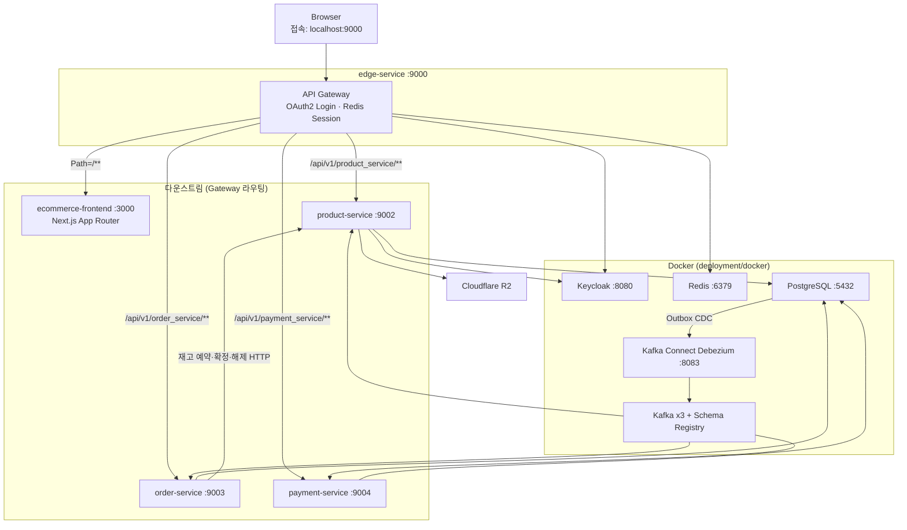

# Ecomart — MSA E-Commerce Backend

상품 탐색부터 장바구니·주문·결제까지 구현한 Spring Boot 기반 마이크로서비스 이커머스 백엔드입니다. **헥사고날 아키텍처와 DDD**로 도메인 규칙과 외부 시스템을 분리하고, **Transactional Outbox·Debezium·Kafka 기반 SAGA**로 서비스 간 부분 실패를 처리합니다.

핵심 설계 과제는 “결제는 완료됐지만 주문 확정에 실패한 경우 어떻게 복구할 것인가”입니다. 정상 처리뿐 아니라 재고 예약 만료, 이벤트 중복 전달, 웹훅 지연, 재시도 소진에 대한 보상과 운영 경로를 구현했습니다.

> 프론트엔드(Next.js)는 별도 저장소 [ecommerce-frontend](https://github.com/Youngwook-Jeon/ecommerce-frontend) 에 있습니다. Gateway가 SPA를 프록시하므로 로컬에서는 두 저장소를 함께 실행합니다.

---

## 프로젝트 하이라이트 & 핵심 문제 해결

분산 트랜잭션의 정합성과 복잡한 상품 조회를 중심으로 설계 선택과 검증 근거를 정리했습니다. 성능 수치는 저장소의 로컬 벤치마크 범위에 한정하며, 운영 규모의 처리량을 의미하지 않습니다.

| 영역 | 한 줄 요약 |
|------|------------|
| 주문·결제 정합성 | 로컬 트랜잭션 + Outbox CDC, 중복 전달을 고려한 멱등 상태 전이 |
| 실패 복구 | 재시도 → DLT → 환불·재고 해제, 장기 미완료 상태 재조정 및 운영 감사 이력 |
| 재고 예약 | 주문 전 soft hold, 결제 성공 시 확정, 실패 시 해제·TTL 만료 |
| 조회 최적화 | 카테시안 곱·N+1 방어, 배치 fetch·쿼리 분리 |
| **공개 PLP 키워드 검색** | `pg_trgm` GIN(이름+브랜드 통합), 선택도별 **~8–11배** GIN 우위 검증 |
| 도메인 동기화 | 옵션 값 이미지 → Variant 썸네일 일괄 반영 |
| 이미지 파이프라인 | R2 Presigned URL로 서버 우회 업로드 |
| 아키텍처 | 헥사고날·DDD로 도메인과 인프라 격리 |

### 1. CQRS · 다중 컬렉션 조회 최적화 (카테시안 곱 방어)

**문제**  
`Product` → `OptionGroup` → `OptionValue`로 이어지는 깊은 집합 구조에서 다중 Fetch Join 시 카테시안 곱 폭증, 연관 컬렉션 로딩 시 N+1이 발생할 수 있습니다.

**적용**
- Hibernate `default_batch_fetch_size` 기반 **IN 절 배치 로딩**
- 연관 그래프를 한 번에 끌어오지 않고, **1차 캐시·쿼리 분리**로 읽기 경로 정리
- CQRS 스타일로 **조회(Queries)** 와 **명령(Commands)** 책임 분리

### 2. 복잡한 도메인 상태 동기화 (Variant Image Sync)

**문제**  
옵션 값(`OptionValue`)에 이미지가 붙으면, 해당 조합을 쓰는 모든 **Variant(SKU)** 의 대표 썸네일이 동일 규칙으로 맞춰져야 합니다.

**적용**
- 출력 포트 `VariantMainImageSyncPort` 로 동기화 책임을 도메인 밖으로 분리
- 갱신 대상 Variant를 **메모리에서 그룹화(In-Memory Grouping)** 후 일괄 반영해 **DB 쓰기 횟수 최소화**

### 3. 클라우드 스토리지 최적화 (비용 · 성능)

**문제**  
관리자 이미지 업로드가 API 서버를 경유하면 메모리·대역폭·타임아웃 부담이 커집니다.

**적용**
- **Cloudflare R2**(S3 호환) **Presigned URL** — `presign` → 클라이언트 **직접 PUT** → `commit` 확인
- 바이너리 트래픽을 애플리케이션 서버 밖으로 분리

### 4. 헥사고날 아키텍처 · DDD

**문제**  
JPA 엔티티와 비즈니스 규칙이 한 레이어에 섞이면 상태 전이·검증 로직이 흩어지고 테스트가 어려워집니다.

**적용**
- `product-domain-core`를 DB · Kafka · R2와 **포트/어댑터**로 격리
- **JPA Entity ↔ Domain Model** 매핑 분리, Aggregate 단위로 비즈니스 룰 응집

### 5. 공개 PLP 키워드 검색 (`pg_trgm` GIN · 선택도)

**문제**  
상품 목록 검색 시 `LIKE '%키워드%'` 로 인한 풀 스캔 성능 저하 우려 및 `name OR brand OR description` 조건 결합 시 발생하는 **BitmapOr** 오버헤드.

**적용 및 검증**
- `description`을 검색 대상에서 제외하고, `name`과 `brand`를 결합한 **단일 GIN 인덱스(`pg_trgm`)** 구축  
  (`lower(coalesce(name,'')) || ' ' || lower(coalesce(brand,''))`)
- Testcontainers(PostgreSQL) 기반 5만 건 시드 데이터로 **선택도 구간별 플래너 실행 계획 및 시간 벤치마크** 진행

**측정 결과와 해석**

- ACTIVE 상품 50,001건의 키워드 단독 조건에서, 선택도 0~1.87% 구간의 강제 GIN은 1.43~2.07ms, 강제 Seq Scan은 15.63~17.14ms로 약 8.27~11.57배 차이를 보였습니다.
- 선택도 4.22%·8.44%에서는 기본 플래너가 Seq Scan을 선택했지만, 해당 실험의 강제 GIN 실행 시간은 더 짧았습니다. 플래너의 선택이 모든 데이터·캐시 조건에서 최적임을 뜻하지는 않습니다.
- 2글자 키워드 `데님`에서는 강제 GIN 70.84ms, Seq Scan 17.51ms로 역전됐습니다. 검색어 길이와 선택도에 따라 실행 계획을 확인해야 하며, 위 수치는 API 전체 응답 시간이나 동시 부하 성능이 아닙니다.

👉 **[상세 벤치마크 리포트 및 분석 결과 보기 (CSV/Markdown)](benchmark-reports/keyword-selectivity-comparison.md)**

---

## 주문·결제 SAGA

Order와 Payment는 각자의 DB 트랜잭션을 커밋하고 Outbox 이벤트로 다음 단계를 진행합니다. 주문 생성·재고 예약은 동기 호출로 조율하고 결제 결과는 이벤트로 반영하는 구조입니다. 전체 과정을 하나의 ACID 트랜잭션으로 묶지 않으므로, 중간 상태를 허용하고 멱등 재시도·보상·재조정으로 정합성을 회복합니다.

### 성공 경로

| 단계 | 처리 주체 / 호출·이벤트 | Order | Payment | 재고·트랜잭션 경계 |
|---|---|---|---|---|
| 1. 체크아웃 검증 | Order → Product: 카탈로그 동기화, 재고 예약 | 생성 전 | 생성 전 | 장바구니 변경 시 재검토 요청. `orderId`를 예약 키로 사용하고 기본 15분 soft hold |
| 2. 주문 저장 | Order: 주문 + `order_outbox` 저장 | `PENDING_PAYMENT` | 생성 전 | 두 쓰기를 같은 로컬 트랜잭션에서 커밋. 예약 HTTP 호출은 이 트랜잭션 밖에서 실행 |
| 3. 결제 작업 접수 | Debezium → `order.created` → Payment | `PENDING_PAYMENT` | `PENDING` | 결제와 provider session 요청을 같은 트랜잭션에 저장. 같은 주문의 재수신은 기존 결제 사용 |
| 4. 결제 수행 | 작업 실행기가 provider session 생성 | `PENDING_PAYMENT` | `PENDING` | Stripe는 PaymentIntent/웹훅으로 결과 확인. Stub은 세션 생성 시 즉시 결과 적용 |
| 5. 결과 영속화 | Payment: 결제 완료 + `payment_outbox` | `PENDING_PAYMENT` | `COMPLETED` | 완료 상태와 이벤트를 같은 로컬 트랜잭션에 저장. Stripe 웹훅은 서명 검증 후 Inbox에 보관하여 처리 |
| 6. 주문 확정 | Debezium → `payment.completed` → Order → Product | `CONFIRMED` | `COMPLETED` | 재고 예약 확정 후 별도 주문 트랜잭션에서 조건부 상태 갱신. 중간 실패 시 멱등 재시도 |
| 7. 화면 반영 | 프론트엔드가 Order 상태 조회 | `CONFIRMED` | `COMPLETED` | 주문 확정 뒤 장바구니 정리는 best-effort. 화면은 결제 SDK 응답이 아닌 주문 상태로 성공 판단 |

### 실패·보상 경로

아래 경로는 실패 지점별 분기이며, 모든 행이 순서대로 실행되는 것은 아닙니다. DLT(Dead Letter Topic)는 재시도 소진 또는 재시도 불가 오류를 별도로 처리하는 토픽입니다.

| 실패 지점 / 조건 | 즉시 처리 | 후속 복구 경로 | 도달 상태·주의점 |
|---|---|---|---|
| 카탈로그 변경·재고 부족 | 주문 생성 거절 | 사용자가 장바구니 확인 후 재시도 | 결제 시작 전 종료 |
| 예약 후 주문 DB 커밋 실패 | 예약 해제 호출 후 원래 오류 반환 | 해제도 실패하면 로그를 남기고 Product 예약 TTL로 회수 | 주문·Outbox는 롤백. 원격 예약은 DB 롤백만으로 취소되지 않음 |
| `order.created` 소비 실패 | Kafka 재시도 후 `order.created.DLT` 보관 | Payment의 DLT 작업이 선점·재생, 한도 초과 시 `ESCALATED` | 같은 주문으로 결제 생성을 재시도. 운영 API에서 replay/resolve 가능 |
| Stripe 결제 **시도** 실패 | `payment_intent.payment_failed` 이력만 기록 | 같은 PaymentIntent에서 후속 결제 결과 대기 | Payment는 `PENDING` 유지. 이 이벤트만으로 주문을 취소하지 않음 |
| 결제 **최종** 실패 | Payment `FAILED` + `payment.failed` Outbox | Order가 `CANCELLED`를 먼저 커밋한 뒤 재고 해제 | Stripe에서는 `payment_intent.canceled`가 최종 실패에 해당 |
| `payment.failed` 처리 중 취소·해제 실패 | 재시도 후 DLT | 보상 기록 + `inventory.release.requested` Outbox → Product 해제 | Product 처리 확인 후 보상 기록 `CLOSED`. 재고 해제만으로 주문 취소까지 보장하지는 않음 |
| 결제 완료 후 재고 만료·거절 또는 불법 주문 상태 전이 | `payment.completed` 처리 오류를 DLT에서 분류 | 보상 기록 + `payment.refund.requested` Outbox → Payment 환불 | 재예약·강제 확정 대신 환불. Payment 처리 확인 후 보상 기록 `REFUNDED` |
| 결제 완료 처리의 일시 장애가 재시도 한도 초과 | DLT 보상 기록에 `REPLAY` 권고 | 원인 확인 및 장기 미완료 주문 재조정 | 권고만으로 자동 DLT 재생이 실행되는 것은 아님 |
| 주문 조회·검증 오류 또는 오류 메타데이터 부족 | `MANUAL` 조치로 보관 | 운영자 조사 | 환불 여부를 단정할 수 없는 건은 자동 환불하지 않음 |
| 환불 소비·provider 호출 실패 | 재시도 후 환불 DLT 보관 | 임대 기반 재생, 한도 초과 시 `ESCALATED` | `compensationEventId`를 로컬 처리 키와 provider 멱등 키로 사용 |
| 웹훅 지연·누락 또는 주문의 결과 반영 누락 | Inbox 재시도 / provider 상태 조회 / Payment 상태 배치 조회 | 이미 존재하는 완료·취소 유스케이스로 재조정 | 반복 실패는 운영 대상으로 남김. 미완료 상태가 모두 자동 종결되는 것은 아님 |

`MANUAL`은 보상 기록의 초기 처리 상태이기도 합니다. **조치(`REFUND`, `RELEASE_INVENTORY`, `REPLAY`, `MANUAL`)와 처리 상태를 구분**해야 합니다. 환불·재고 해제 조치는 Outbox로 자동 전달되고, `SagaCompensationExecutor`는 실제 실행 대신 대상 서비스의 처리 기록을 조회합니다.

현재 Payment 도메인의 상태는 `PENDING`, `COMPLETED`, `FAILED`입니다. 환불은 별도 처리 기록으로 관리하므로, **보상 기록의 `REFUNDED`가 Payment의 상태 변경이나 주문 취소를 뜻하지 않습니다.** 예약 TTL 만료도 Product의 재고 회수이며 Order의 자동 `EXPIRED` 전이와 동일하지 않습니다.

### 정합성을 위한 선택과 비용

| 설계 선택 | 해결하려는 문제 | 보장 범위 / 남는 비용 |
|---|---|---|
| Transactional Outbox + Debezium CDC | DB 저장과 Kafka 발행 사이의 이중 쓰기 실패 | 로컬 상태·발행 의도를 원자적으로 저장. CDC 지연과 중복 소비에 대한 대응은 별도로 필요 |
| 멱등 처리 + 조건부 상태 갱신 | 재전달·동시 처리에 의한 중복 결제·잘못된 상태 덮어쓰기 | 주문 ID, provider event ID, 보상 event ID 등 경계별 키 사용. 시스템 전체 exactly-once를 주장하지 않음 |
| 재고 soft hold + TTL | 결제 대기 중 판매 가능 재고 확보와 고아 예약 회수 | 결제 지연이 TTL을 넘으면 이미 결제됐더라도 환불이 필요할 수 있음 |
| 재시도와 DLT 분리 | 일시 장애와 영구 오류의 무한 재시도 방지 | Order 기본 정책은 최초 실패 뒤 1초 간격 최대 3회 재시도. 재시도 불가 예외는 바로 DLT로 이동 |
| 웹훅 Inbox + 상태 재조정 | 웹훅 반영 실패·이벤트 누락, provider 연결 정보를 찾지 못하는 예외 상황 | 영속 작업·외부 조회 비용 발생. Inbox 재시도 소진은 `ESCALATED`이며 결제의 `FAILED` 전이가 아님 |
| 운영 API + 감사 이력 | 자동 처리만으로 해결할 수 없는 건의 추적 가능한 복구 | 장기 미완료 주문의 replay/close/refund와 처리자·사유·요청 ID 이력 관리 |

코드 탐색: [주문 처리](order-service/order-domain/order-domain-application/src/main/java/com/project/young/orderservice/application/service/OrderApplicationService.java) · [결제 처리](payment-service/payment-domain/payment-domain-application/src/main/java/com/project/young/paymentservice/application/service/PaymentApplicationService.java) · [보상 분류](order-service/order-domain/order-domain-application/src/main/java/com/project/young/orderservice/application/compensation/CompensationDecisionClassifier.java) · [보상 Outbox 저장](order-service/order-domain/order-domain-application/src/main/java/com/project/young/orderservice/application/service/SagaCompensationApplicationService.java) · [보상 완료 확인](order-service/order-domain/order-domain-application/src/main/java/com/project/young/orderservice/application/service/SagaCompensationExecutor.java) · [주문 상태 재조정](order-service/order-domain/order-domain-application/src/main/java/com/project/young/orderservice/application/service/OrderPaymentReconciliationExecutor.java).

### 대표 설계 결정과 대안

아래는 현재 구현의 선택 이유와 대안별 비용입니다. 대안들을 모두 구현하여 성능을 비교했다는 의미는 아닙니다.

| 결정 | 검토할 수 있는 대안 | 현재 선택의 이유 | 감수하는 비용 / 경계 |
|---|---|---|---|
| 상태 변경과 이벤트 발행 의도를 같은 DB 트랜잭션에 저장 | DB 커밋 뒤 Kafka 직접 발행 | 커밋 직후 프로세스가 종료돼도 발행 의도를 Outbox에 남길 수 있음 | Debezium 운영·CDC 지연이 추가됨. 소비자 멱등성은 별도 책임 |
| 재고 예약은 동기 호출, 결제 결과는 이벤트로 반영 | 구매 전 과정을 동기 호출하거나 모든 단계를 비동기로 처리 | 재고 부족은 주문 생성 전에 응답하고, 사용자 결제·웹훅 대기는 `PENDING_PAYMENT`로 표현 | 예약과 주문 저장 사이의 원자성은 없음. 해제 보상·TTL과 중간 상태 UI 필요 |
| 웹훅을 Inbox에 영속화한 뒤 작업 실행기가 적용 | 웹훅 HTTP 요청 안에서 결제 상태를 즉시 변경 | 접수와 비즈니스 처리를 분리하고 처리 실패를 로컬에서 재시도 | 작업 지연·재시도 상태 관리 필요. 누락된 웹훅은 Inbox만으로 복구할 수 없어 provider 조회로 보완 |
| 기대 상태를 조건으로 DB 갱신 | 읽은 엔티티의 상태를 조건 없이 덮어쓰기 | 읽기 이후 상태가 바뀌면 갱신 실패를 감지하고 다시 판단 | 조건부 갱신은 해당 DB 행의 보호 수단. 원격 재고 확정이나 별도 환불 작업까지 원자화하지 않음 |

웹훅 선도착은 정상 체크아웃의 대표 시나리오로 가정하지 않습니다. 현재 UI는 DB에 저장된 client secret을 조회한 뒤 결제를 확정하고, `payment_intent.created`는 Inbox 처리 대상이 아닙니다. 연결 정보 부재에 대한 재시도는 예외 조건을 방어하며, 관련 단위 테스트도 이 조건을 모의합니다.

### 현재 상태 전이와 경합 방지 범위

| 대상 | 현재 허용 전이 / 중복 처리 | 보호 수단과 한계 |
|---|---|---|
| Order | `PENDING_PAYMENT → CONFIRMED` 또는 `CANCELLED`. 같은 결과 재호출은 멱등 처리 | 기대 상태를 조건으로 갱신. 재고 확정은 주문 상태 갱신보다 먼저 수행되어 원격 부수 효과가 남는 구간이 있음 |
| Payment | `PENDING → COMPLETED` 또는 `FAILED`. 결제 시도 실패는 `PENDING` 유지 | provider event ID 중복 검사와 기대 상태 조건부 갱신. 이미 종료된 결제는 웹훅으로 다른 종료 상태에 덮어쓰지 않음 |
| 환불 보상 | Payment `COMPLETED`를 유지하고 별도 보상 처리 기록 저장 | 같은 `compensationEventId` 재처리 방지. 서로 다른 보상 ID로 같은 결제를 환불하는 업무 중복까지 방지한다는 의미는 아님 |
| 운영자 재조정 | 재조정 레코드를 조건부 선점하여 replay·환불 요청 처리 | 해당 레코드의 작업 경합을 제어하지만, Kafka 주문 확정 경로와 공유하는 최종 결정 잠금은 아님 |

따라서 로컬 상태 갱신의 충돌 감지와 서비스 전체의 확정·환불 상호 배제는 구분해야 합니다. **후속 설계 제안(미구현)**은 주문 확정과 보상 결정이 공유하는 영속 상태를 Order에 두고, 원격 호출 전에 조건부 전이로 실행 방향을 결정하는 것입니다. 환불 결정 후 늦은 결제 완료 이벤트가 주문을 다시 확정하지 못하게 하고, 환불 실행 상태는 Payment가 소유하도록 분리합니다. 임대 만료는 같은 결정을 재실행하는 조건이며, 반대 결정으로 전환하는 근거로 사용하지 않습니다.

### 이벤트 계약

SAGA 이벤트는 **JSON**이며, 상품 카탈로그의 Avro/Schema Registry 연동과 구분합니다. Outbox를 Debezium으로 전달하는 설정은 [CDC 문서](deployment/docker/DEBEZIUM.md)와 [커넥터 설정](deployment/docker/connectors)을 참고하세요.

| 토픽 | Outbox 소유 서비스 → 소비 서비스 | 목적 |
|---|---|---|
| `order.created` | Order → Payment | 결제 시작 |
| `payment.completed` | Payment → Order | 재고 확정·주문 확정 |
| `payment.failed` | Payment → Order | 주문 취소·재고 해제 |
| `payment.refund.requested` | Order → Payment | 결제 완료 후 주문 처리 불가에 대한 환불 |
| `inventory.release.requested` | Order → Product | 실패한 재고 해제의 비동기 보상 |

## 시스템 구성


```mermaid
flowchart TB
  Browser["Browser\n접속: localhost:9000"]

  subgraph Gateway["edge-service :9000"]
    Edge["API Gateway\nOAuth2 Login · Redis Session"]
  end

  subgraph Apps["다운스트림 (Gateway 라우팅)"]
    SPA["ecommerce-frontend :3000\nNext.js App Router"]
    Product["product-service :9002"]
    Order["order-service :9003"]
    Payment["payment-service :9004"]
  end

  subgraph Infra["Docker (deployment/docker)"]
    KC["Keycloak :8080"]
    Redis["Redis :6379"]
    PG["PostgreSQL :5432"]
    Kafka["Kafka x3 + Schema Registry"]
    Connect["Kafka Connect Debezium :8083"]
  end

  Browser --> Edge
  Edge -->|"Path=/**"| SPA
  Edge -->|"/api/v1/product_service/**"| Product
  Edge -->|"/api/v1/order_service/**"| Order
  Edge -->|"/api/v1/payment_service/**"| Payment
  Edge --> Redis
  Edge --> KC
  Product --> PG
  Order --> PG
  Payment --> PG
  Product --> KC
  Order -->|"재고 예약·확정·해제 HTTP"| Product
  PG -->|"Outbox CDC"| Connect
  Kafka --> Product
  Kafka --> Order
  Kafka --> Payment
  Connect --> Kafka
  Product --> R2["Cloudflare R2"]
```

### 서비스 포트

| 서비스 | 포트 | 역할 |
|--------|------|------|
| `edge-service` | 9000 | API Gateway, OAuth2 로그인, Redis 세션, SPA 프록시 |
| `product-service` | 9002 | 상품·카테고리·옵션·이미지·재고 API |
| `order-service` | 9003 | 카트·주문·payment saga 소비 |
| `payment-service` | 9004 | 결제·Stripe webhook·payment outbox |
| `customer-service` | 9001 | 스켈레톤 (Gateway 라우트·도메인 구현 예정) |
| Kafka Connect | 8083 | Debezium outbox CDC |
| Keycloak | 8080 | Realm `Ecomart`, Client `edge-service` |
| PostgreSQL | 5432 | DB `ecodb_product`, `ecodb_order`, `ecodb_payment` |
| Redis | 6379 | Gateway 세션, 비회원 장바구니, 상품 상세 캐시 |
| Kafka brokers | 19092 / 29092 / 39092 | 로컬 리스너 |
| Schema Registry | 8081 | Avro 스키마 |
| Kafka UI | 9090 | 클러스터 모니터링 |

Gateway 경로 예시:

- 상품 API: `http://localhost:9000/api/v1/product_service/**` → `product-service` 로 rewrite
- 주문·결제 API: `/api/v1/order_service/**`, `/api/v1/payment_service/**`
- `customer-service`는 스켈레톤이며 기본 기동·Gateway 라우팅 대상이 아닙니다.
- 공개(비인증) 상품 경로: `GET /api/v1/product_service/public/products`
- SPA: `http://localhost:9000/**` → `http://localhost:3000`

---

## 기술 스택

- **Language / Runtime:** Java 21
- **Framework:** Spring Boot 3.5, Spring Cloud Gateway 2025, Spring Security OAuth2
- **Persistence:** PostgreSQL 18, Spring Data JPA, QueryDSL, Flyway
- **Messaging:** Apache Kafka, Confluent Schema Registry, Avro
- **Auth:** Keycloak 25
- **Cache / Session:** Redis 7
- **Object Storage:** AWS SDK v2 (Cloudflare R2)
- **Build:** Maven (wrapper 포함)
- **Test:** JUnit 5, Spring Security Test, Testcontainers

---

## 저장소 구조

```
ecommerce-msa/
├── pom.xml                      # 루트 BOM · 모듈 집계
├── common-library/              # 공통 도메인·웹 유틸
│   ├── common-domain/           # AggregateRoot, ValueObject, DomainEvent
│   └── common-application/      # 공통 예외 처리 등
├── edge-service/                # Spring Cloud Gateway + OAuth2 Client
├── customer-service/            # 고객 서비스 (진행 중)
├── product-service/             # 상품 바운디드 컨텍스트 (헥사고날)
│   ├── product-domain/
│   │   ├── product-domain-core/         # 엔티티, 도메인 서비스, 규칙
│   │   └── product-domain-application/  # Use case, Command/Query
│   ├── product-dataaccess/      # JPA 엔티티, Repository 어댑터
│   ├── product-web/             # REST Controller, DTO, Security
│   ├── product-messaging/       # 카탈로그 이벤트·캐시 무효화·재고 해제 소비
│   └── product-service-main/    # Spring Boot 실행 모듈, Flyway
├── order-service/               # 카트·주문·SAGA 보상 (domain/dataaccess/web/messaging/main)
├── payment-service/             # 결제·provider·Inbox·DLT (동일 레이어 구조)
├── saga-e2e-tests/              # 실제 CDC → 환불 소비 경로 통합 검증
├── infra/kafka/                 # kafka-config, kafka-model, kafka-producer
└── deployment/docker/           # 로컬 인프라 Compose 스택
```

### product-service 레이어 (헥사고날)

```
[ product-web ]          ← Driving Adapter (HTTP)
        ↓
[ product-domain-application ]  ← Application Layer (Use Cases)
        ↓
[ product-domain-core ]         ← Domain Layer
        ↑
[ product-dataaccess ]   ← Driven Adapter (DB)
[ product-messaging ]    ← Driven Adapter (Kafka)
[ R2 Storage Adapter ]   ← Driven Adapter (product-web/storage)
```

**주요 도메인 기능**

- 카테고리 계층·상태 관리
- 상품 생성·수정·상태 전이(DRAFT → ACTIVE 등)
- 글로벌/상품 단위 옵션 그룹·옵션 값
- SKU·옵션 조합 기반 **Variant** 관리
- 관리자용 이미지 presign → 업로드 → commit / reorder / delete
- 옵션 값별 이미지 및 Variant 대표 이미지 동기화

---

## 사전 요구 사항

| 도구 | 버전 | 용도 |
|------|------|------|
| JDK | 21 | 빌드·실행 |
| Docker / Docker Compose | 최신 권장 | 인프라 기동 |
| `curl`, `jq`, `nc` | - | 헬스체크·커넥터 등록 |
| [kcat](https://github.com/edenhill/kcat) | - | `deployment/docker/startup.sh` 에서 Kafka 헬스체크 |
| (선택) Cloudflare R2 | - | 이미지 업로드 API 사용 시 |

---

## 로컬 실행

워크스페이스 루트(`msa-ecomm-project/`)에서 **Makefile**로 인프라 → 앱(Flyway) → Debezium까지 한 번에 올릴 수 있습니다.  
(이 README는 `ecommerce-msa` 기준이며, Make 명령은 **상위 워크스페이스 루트**에서 실행합니다.)

### 권장: `make up`

```bash
# 워크스페이스 루트
cd ..   # ecommerce-msa → msa-ecomm-project (이미 루트면 생략)

cp ecommerce-msa/.env.example ecommerce-msa/.env   # 최초 1회
make check-prereqs
make up
```

기본 `.env`는 `PAYMENT_PROVIDER=stub`, `R2_ENABLED=false` 이라 Cloudflare/Stripe 시크릿 없이 기동됩니다.

| 포함 서비스 | 포트 |
|-------------|------|
| edge-service (Gateway) | 9000 |
| product-service | 9002 |
| order-service | 9003 |
| payment-service | 9004 |

중지(앱 PID + 인프라 컨테이너 stop, 볼륨 유지):

```bash
make down
```

유용한 타깃: `make infra-up|infra-stop|infra-reset`, `make apps`, `make apps-restart-payment`, `make debezium`, `make package`, `make run-jar SERVICE=payment`, `make frontend`, `make stripe-listen`.

로그/PID: 워크스페이스 `.run/logs`, `.run/pids`.

### Stripe 테스트 결제 (선택)

1. `ecommerce-msa/.env`에만 설정:
   ```bash
   PAYMENT_PROVIDER=stripe
   STRIPE_API_KEY=sk_test_...
   ```
   (`STRIPE_WEBHOOK_SECRET`은 `.env`에 넣을 필요 없음)
2. `make up` 또는 `make apps`  
   - `stripe listen --print-secret`으로 CLI `whsec_`를 받아 **프로세스 환경에 주입**  
   - `stripe listen --forward-to ...`를 **백그라운드**로 기동  
   - 그다음 payment-service 기동  
3. FE: `ecommerce-frontend/.env.local`에 `NEXT_PUBLIC_STRIPE_PUBLISHABLE_KEY`  
4. `make down` 시 백그라운드 listen도 함께 종료  

이벤트 로그를 직접 보고 싶으면 `make stripe-listen`(포그라운드, 디버그용).

### Debezium

Outbox CDC 상세는 [deployment/docker/DEBEZIUM.md](deployment/docker/DEBEZIUM.md).  
`make up`이 Flyway 이후 `setup-debezium.sh`까지 실행합니다. 커넥터만 다시 등록하려면 `make debezium`.

### 프론트엔드 (선택)

워크스페이스에 `ecommerce-frontend`가 있으면:

```bash
make frontend
# 또는
cd ../ecommerce-frontend && bun install && bun run dev
```

브라우저: `http://localhost:9000` (Gateway가 `:3000` SPA로 프록시)

어드민 패널 등 관리자 기능은 Gateway 로그인 후 사용합니다. 테스트 계정은 [관리자 로그인](#관리자-로그인) 참고.

### 환경 변수 — Cloudflare R2 (이미지 API)

기본은 `R2_ENABLED=false`(로컬 stub 스토리지). 실제 R2를 쓰려면 `.env`에:

```bash
R2_ENABLED=true
R2_ENDPOINT=https://<account_id>.r2.cloudflarestorage.com
R2_ACCESS_KEY_ID=...
R2_SECRET_ACCESS_KEY=...
R2_BUCKET=...
R2_PUBLIC_BASE_URL=https://...
```

### 배포 대비 (JAR)

```bash
make package
make run-jar SERVICE=payment   # edge|product|order|payment|customer
```

앱 Docker 이미지/K8s는 별도 작업입니다.

---

## API 개요

상품 Gateway prefix는 `/api/v1/product_service`입니다. 아래 경로는 prefix를 제거한 서비스 내부 경로입니다.

| 구분 | 경로 패턴 | 인증 |
|------|-----------|------|
| 공개 상품 목록 | `GET /public/products` | 불필요 (Gateway·서비스 모두 permit) |
| 공개 상품 상세 (PDP) | `GET /public/products/{productId}` | 불필요 — 계약: `product-service/docs/STOREFRONT_PRODUCT_DETAIL.md` |
| 카테고리·조회 | `GET /categories/**`, `GET /queries/categories/hierarchy`, `GET /queries/option-groups/**` | 불필요 |
| 관리자 상품·이미지 | `/admin/products/**` | JWT + `ADMIN` 역할 |
| 기타 변경 API | `/admin/**`, `POST/PUT/PATCH/DELETE` | JWT 필요 |

**예시 — 공개 상품 목록**

```bash
# 실제 ACTIVE 카테고리 ID로 교체
curl "http://localhost:9000/api/v1/product_service/public/products?categoryId=10&page=0&size=20"
```

### 주문·결제 API

| 서비스 prefix | 주요 경로 | 용도 |
|---|---|---|
| `/api/v1/order_service` | `/carts/current`, `/carts/current/items`, `/carts/current/sync`, `/carts/current/merge` | 비회원·회원 카트, 동기화·로그인 병합 |
| `/api/v1/order_service` | `POST /orders`, `GET /orders/{orderId}` | 인증 사용자 주문 생성·본인 주문 상태 조회 |
| `/api/v1/payment_service` | `GET /payments/orders/{orderId}/client-secret` | 결제 입력용 세션 조회 |
| `/api/v1/payment_service` | `POST /webhooks/stripe` | Stripe 서명 검증 후 웹훅 접수 |
| `/api/v1/order_service` | `/admin/operations/payment-reconciliation-escalations` | 장기 미완료 주문의 운영 조회·replay·close·refund·history |
| `/api/v1/payment_service` | `/admin/operations/order-created-dlts`, `/admin/operations/provider-escalations` | 결제 시작 DLT·provider 작업 실패 운영 조회 |

운영 API는 `ADMIN` 권한을 요구합니다. 주문 재조정의 수동 처리에는 처리자·요청 ID·사유를 감사 이력으로 남깁니다. 이 경로들은 자동 복구 한도를 넘은 건을 조사하고 처리하기 위한 수단입니다.

**예시 — 로그인 사용자 정보 (Gateway)**

```bash
curl -b cookies.txt "http://localhost:9000/authentication"
```

Keycloak 관리 콘솔: `http://localhost:8080` (admin / admin)  
Realm: `Ecomart`

### 관리자 로그인

어드민 패널·상품 관리 API 등 `ADMIN` 역할이 필요한 기능은 `http://localhost:9000` 에서 로그인한 뒤 사용합니다.

| 항목 | 값 |
|------|-----|
| 이메일 | `lucas@lucas.com` |
| 비밀번호 | `password` |

로컬 Keycloak Realm `Ecomart` 에 미리 등록된 테스트 계정입니다.

---

## 인증 흐름

1. 사용자가 Gateway(`edge-service`)에 접속 → Keycloak Authorization Code 로그인
2. Gateway가 Redis에 세션 저장 (`ecomart:edge` namespace)
3. API 호출 시 Gateway가 세션·CSRF 처리, 다운스트림 서비스는 **JWT Resource Server** 로 토큰 검증
4. `roles` 클레임 기반 `@PreAuthorize` / 경로별 `ADMIN` 검사

공개 스토어프론트 API는 Gateway `PublicApiPaths` 와 product-service `SecurityConfig` 양쪽에서 anonymous 허용됩니다.

---

## 데이터베이스

로컬 PostgreSQL 인스턴스 안에서 `ecodb_product`, `ecodb_order`, `ecodb_payment`로 데이터를 분리합니다. 각 서비스 실행 모듈의 `src/main/resources/db/migration/`을 Flyway로 적용하며, 다른 서비스 DB를 직접 갱신하는 대신 API·이벤트로 연동합니다.

---

## 테스트

```bash
# ecommerce-msa 디렉터리에서 실행. 통합 테스트에는 Docker 필요
./mvnw clean verify

# product-service 만
./mvnw -pl product-service/product-service-main -am test

# 특정 모듈
./mvnw -pl order-service/order-service-main -am test

# 실제 Order 환불 Outbox → Debezium → Kafka → Payment 소비 검증
./mvnw -pl saga-e2e-tests -am verify
```

그 외 테스트 유형:

- **Domain:** 엔티티 불변식, 상태 전이, 도메인 서비스 규칙
- **Application:** Use case 시나리오, Mock 포트
- **Dataaccess:** JPA Repository, Adapter (Testcontainers PostgreSQL)
- **Web:** `@WebMvcTest`, Security `@WithMockUser`
- **Integration:** `ProductApiIntegrationTest`, `CategoryApiIntegrationTest`
- **SAGA:** `OrderPaymentSagaKafkaIntegrationTest`, `OrderOutboxDebeziumIntegrationTest` — 결제 이벤트 소비와 주문 Outbox CDC
- **Recovery:** `SagaCompensationApplicationServiceTest`, `ProviderWebhookInboxExecutorTest`, `OrderPaymentReconciliationExecutorTest` — 보상·웹훅 재처리·상태 재조정
- **CDC E2E:** `RefundOutboxToPaymentConsumerIT` — PostgreSQL·Kafka·Debezium Connect와 서비스 컨테이너를 사용한 환불 전달 경로. 전체 브라우저 구매 과정이나 실제 Stripe 환불의 E2E 검증을 뜻하지 않음
- **Benchmark (수동):** `PublicProductKeywordSearchBenchmarkIT` — PLP 키워드 선택도·GIN vs Seq Scan 리포트 (`RUN_KEYWORD_BENCHMARK=true`, [§5](#5-공개-plp-키워드-검색-pg_trgm-gin--선택도) 참고)
