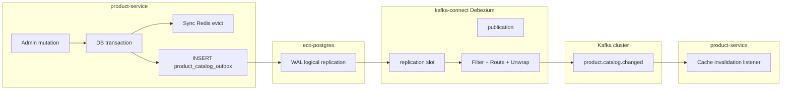

# Debezium Outbox CDC — 인프라 설계 (product-service)

`product_catalog_outbox` 테이블 INSERT를 PostgreSQL WAL → Debezium → Kafka `product.catalog.changed` 로 relay합니다.  
앱 내부 폴링(`ProductCatalogOutboxPublisher`)을 대체하는 **인프라 레이어**입니다.

## 아키텍처



### 현재 인프라 vs 앱 책임

| 레이어 | 책임 |
|--------|------|
| **앱 (유지)** | mutation 트랜잭션 안에서 outbox INSERT + sync Redis evict |
| **PostgreSQL** | `wal_level=logical`, replication slot, publication |
| **Kafka Connect** | WAL capture, INSERT만 필터, topic 라우팅 |
| **앱 (제거 예정)** | `ProductCatalogOutboxPublisher` 스케줄 폴링 |
| **앱 (조정 예정)** | Kafka consumer — JSON payload ↔ Avro 호환 |

## Docker 구성

| 파일 | 역할 |
|------|------|
| `kafka_connect.yml` | `quay.io/debezium/connect:3.0` (REST `:8083`) |
| `backing_services.yml` | Postgres `wal_level=logical` |
| `init_kafka.yml` | `_connect_*` 내부 토픽 + `product.catalog.changed` |
| `connectors/product-catalog-outbox-connector.json` | Connector 정의 |
| `scripts/setup-debezium.sh` | grant + connector 등록 |

### 네트워크·엔드포인트

| 서비스 | Docker 내부 | Host |
|--------|-------------|------|
| PostgreSQL | `eco-postgres:5432` | `localhost:5432` |
| Kafka | `kafka-broker-{1,2,3}:9092` | `localhost:19092,...` |
| Schema Registry | `schema-registry:8081` | `localhost:8081` |
| Kafka Connect | `kafka-connect:8083` | `localhost:8083` |

## PostgreSQL 설정

### 필수 파라미터 (`backing_services.yml`)

```text
wal_level = logical
max_replication_slots = 4
max_wal_senders = 4
```

> **주의:** 기존 Postgres 볼륨이 있으면 `wal_level` 이 반영되지 않습니다.  
> `shutdown.sh` 로 볼륨 삭제 후 재기동하거나, 수동으로 `ALTER SYSTEM` + 재시작이 필요합니다.

### Debezium DB 사용자 (`init.sql`)

```text
ROLE debezium — REPLICATION LOGIN
GRANT CONNECT ON DATABASE ecodb_product
```

테이블 권한은 Flyway 마이그레이션 **이후** 스크립트로 부여합니다.

```bash
./scripts/grant-debezium-outbox.sh
```

`grant-debezium-outbox.sh`는 호스트에 `psql`이 없어도 **`eco-postgres` 컨테이너 안에서** `psql`을 실행합니다 (`PG_USE_DOCKER=auto` 기본).  
`user`(POSTGRES superuser)로 schema/table GRANT + **publication 사전 생성**까지 수행합니다.

## Connector 동작

### 대상

- **DB:** `ecodb_product`
- **Schema:** `product`
- **Table:** `product.product_catalog_outbox`
- **Plugin:** `pgoutput`
- **Slot:** `product_catalog_outbox_slot`
- **Publication:** `dbz_product_catalog_outbox_pub` — `grant-debezium-outbox.sh`에서 **admin(`user`)** 이 미리 생성 (`publication.autocreate.mode=disabled`)

### Transform 파이프라인

1. **skipped.operations** — `u,d,t` (UPDATE/DELETE/TRUNCATE 제외, INSERT만 캡처). Groovy Filter SMT 불필요.
2. **RegexRouter** — `product.catalog.changed` 로 고정 라우팅
3. **ExtractNewRecordState** — Debezium envelope 제거, row 컬럼만 JSON value

### 메시지 형식 (인프라 1단계)

| 항목 | 값 |
|------|-----|
| Topic | `product.catalog.changed` |
| Key | `product_id` (UUID string) |
| Value | JSON — `event_id`, `product_id`, `category_id`, `change_type`, `occurred_at`, ... |

```json
{
  "event_id": "01932a1c-...",
  "product_id": "01932a1c-...",
  "category_id": 12,
  "change_type": "PRODUCT_UPDATED",
  "occurred_at": "2026-06-09T12:34:56.789Z",
  "published_at": null,
  "created_at": "2026-06-09T12:34:56.789Z"
}
```

### Snapshot

`snapshot.mode = no_data` — 기존 outbox row 재발행 없음, **신규 INSERT만** 스트리밍.

폴링 → CDC 전환 시 `published_at IS NULL` 인 미발행 row는 **1회 수동 발행** 또는 snapshot 1회 실행 정책이 필요합니다.

## 로컬 기동 순서

```bash
cd deployment/docker

# 1) Zookeeper → Kafka → topics → Postgres/Redis/Keycloak → Connect
./startup.sh

# 2) product-service 1회 기동 (Flyway V6 outbox 테이블 생성)
#    mvn -pl product-service/product-service-main spring-boot:run

# 3) Debezium grant + connector 등록
chmod +x scripts/*.sh
./scripts/setup-debezium.sh
```

### Connector 상태 확인

```bash
curl -s http://localhost:8083/connectors/product-catalog-outbox-connector/status | jq .
curl -s http://localhost:8083/connectors/product-catalog-outbox-connector/tasks | jq .
```

### 수동 재등록

```bash
curl -X DELETE http://localhost:8083/connectors/product-catalog-outbox-connector
./scripts/setup-debezium.sh
```

## Avro / Schema Registry (2단계 — 앱 연동)

현재 connector는 **JSON value** 입니다. 기존 consumer는 `ProductCatalogChangedAvroModel` (Confluent Avro)를 기대합니다.

전환 옵션:

| 옵션 | 설명 |
|------|------|
| **A. Consumer JSON 수용** | `ProductCatalogCacheInvalidationListener` 에 JSON deserializer 추가 (가장 단순) |
| **B. Connect AvroConverter** | value converter + SMT로 Avro 스키마 매핑 |
| **C. Outbox EventRouter + payload JSONB** | 표준 outbox payload 컬럼 추가 후 EventRouter SMT |

인프라 1단계는 **A 또는 B 결정 전** JSON으로 검증하는 것을 권장합니다.

## 운영 체크리스트

- [ ] Replication slot lag 모니터링 (`pg_replication_slots`)
- [ ] WAL 디스크 사용량 (`wal_level=logical` 시 retention 정책)
- [ ] Connect task FAILED 시 `_connect_statuses` 토픽 / REST status
- [ ] Connector 설정 변경 시 `PUT /connectors/{name}/config`
- [ ] `published_at` 컬럼 — CDC 전환 후 앱 poller 제거 시 deprecated

## 다음 단계 (앱 코드)

1. `product-service.catalog-events.relay: debezium | polling` 프로퍼티 분기
2. `ProductCatalogOutboxPublisher` — `debezium` 일 때 `@ConditionalOnProperty` 비활성
3. Consumer JSON ↔ Avro 정합
4. `published_at` 컬럼 제거 또는 정리 배치 전용으로 축소
